# Immunization Tracking and Alerts for Schools

### Team
* Prakash Bhatta 
* Josh Fox
* Liz Hesser 
* Keyur Itchhaporia 
* Chris Story 
* Kourtney Wright

## Overview

Immunization rates in school populations are difficult to actively track. When rates fall below certain thresholds, students without immunizations are at risk for contracting major and potentially deadly Vaccine Preventable Diseases (VPDs).

The goal of this app is to allow simple data entry of student immunization records by the school healthcare provider to track the school populace immunization status. There is an executive dashboard that shows the overall health status of a school from an immunization standpoint and notifies administrators when immunization rates change or dip below repudiable guidelines (such as the CDC).

The app development is achieved by utilizing Angular JS, Java, and mySQL. Angular JS is utilized to supply the front-end User Interface (UI) to the user to view, update and query student immunization records and view overall school status. Java is utilized to interface with the User Interface and the Fast Healthcare Interoperability Resources (FHIR) electronic healthcare information specification. FHIR is where each student's healthcare information is stored. MySQL is utilized to store each student's basic information (name, age, class).

### Dependencies
* Front-End = Angular JS
* Back-End = Java
* Database = mySQL
* Fast Healtcare Interoperability Resources (FHIR) Specification

# Manual

## Logging In/Registering a New User

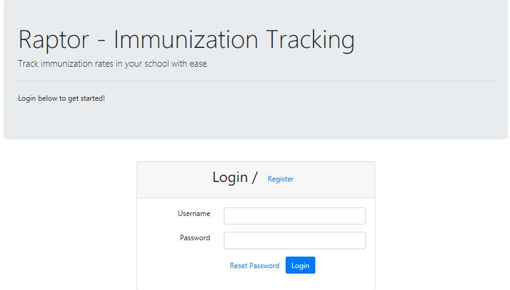

**To log in to an already existing account:**

* Enter username and password on the login screen
* Click the *login* button

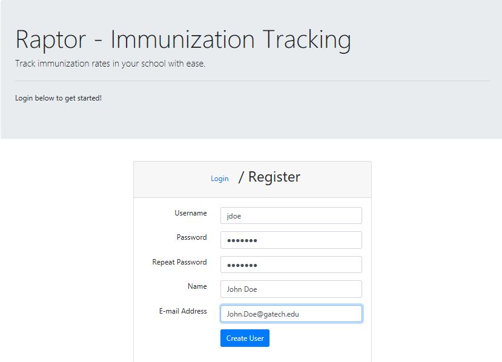

**To register a new user:**

*While this feature is displayed on the UI, it is not currently functional and additional user accounts cannot be created at this time.*

* Toggle to the register tab by clicking *Register* at the top of the prompt - *Login* is the default option
* Enter desired username and password
* Confirm password by re-entering it
* Enter name and email address
* Click *Create User* to create new account

## Dashboard

Once a user has logged in, they will be taken to the application's dashboard where they will be shown any alerts related to their school.

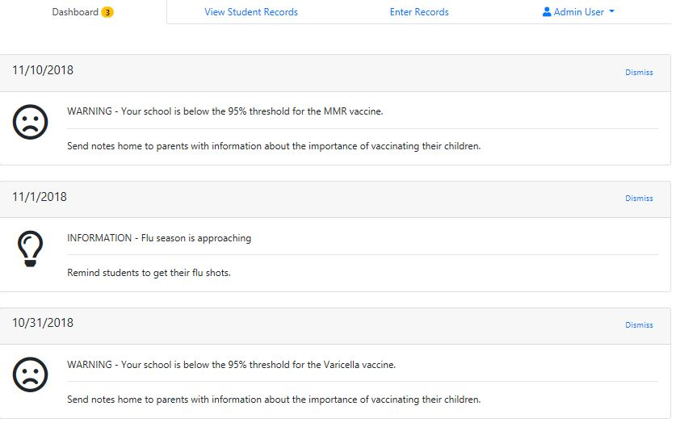

* Alerts that require a user to take action will be labeled as a **WARNING**.
* Alerts that are only for informational purposes and may not require user action are labeled as **INFORMATION**.
* Alerts will be organized in the order in which they are received.
* To remove an alert from the dashboard that has already been reviewed, select *Dismiss* in the top corner of the alert. - *While this feature is displayed on the UI, it is not currently functional and alerts cannot be dismissed at this time.*

## View Student Records

The View Student Records tab will allow users to view a summary of any student that currently has a profile in the system. This summary includes the student's name, percentage of immunizations completed, grade, date of birth, and homeroom teacher. From this screen users can view record summaries, delete existing student profiles, and search student profiles. Users can also choose to edit or add students from this screen.

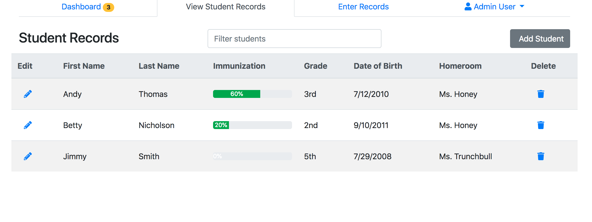

* To **search** existing student records, users can enter any piece of information related to the student they wish to search into the *Filter Students* search bar at the top of the screen.

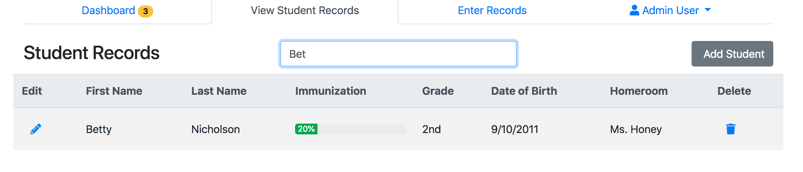

* To **delete** an existing student record, select the trash icon next to the record that is to be deleted.
 
* To **edit or view** a detailed existing student record, select the pencil icon next to the name of the student whose record tht needs to be edited or viewed.

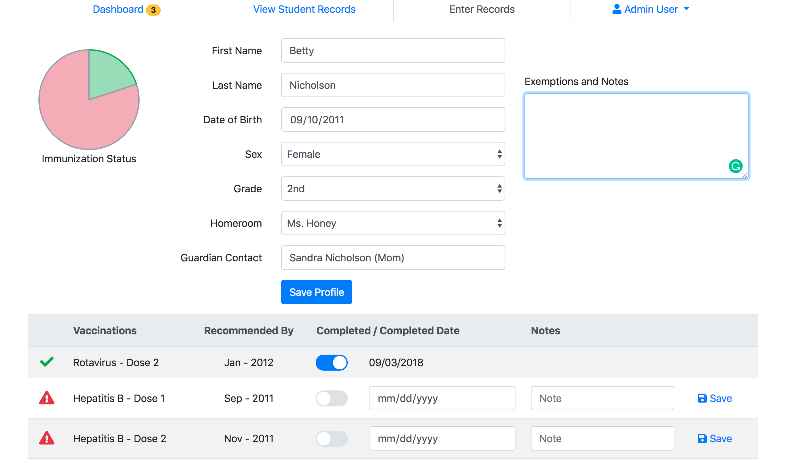

* To **add** a new student profile, select the *Add Student* button in the top corner of the screen, and the will redirect to the Enter Records screen. In order to enter immunization records for a new student, a user must first create a profile for that student.

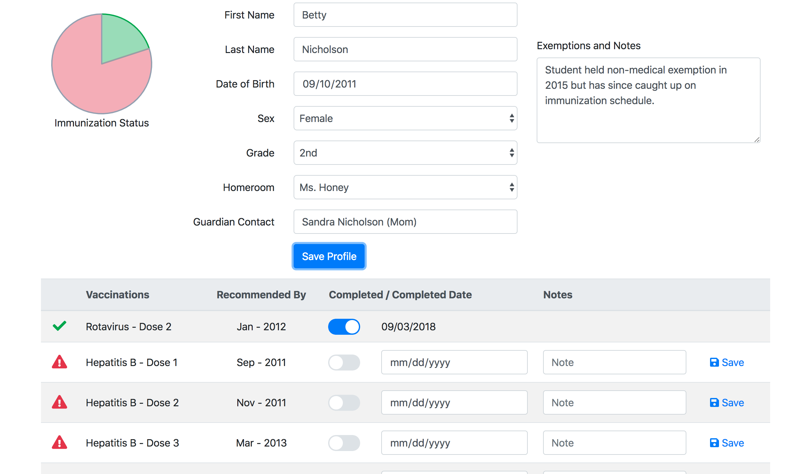

## Enter Records
A new student record can be added from either the View Student Records tab, as indicated above, or from the Enter Records tab, shown below.

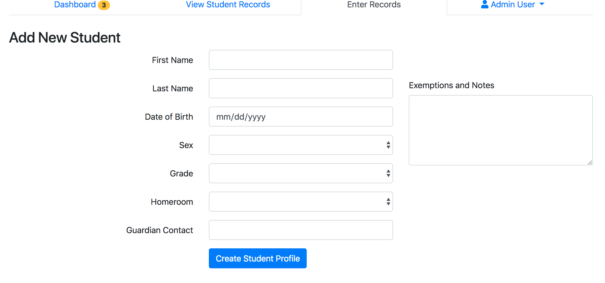

To complete a new student profile, the user will be prompted to enter the following information for the student they wish to add to the system:

* Name - First and Last
* Date of Birth - mm/dd/yyyy
* Sex
* Grade
* Homeroom
* Guardian Contact - This is a free text field, please include at least one parent/guardian and phone number
* Exemptions and Notes - Enter any notes from doctors or parent/guardians here 

**Add a vaccination to a student record:**

Once the new record is created, a table of vaccinations will be available below the student's information. All vaccines in the table will default to incomplete when the table is initially generated.

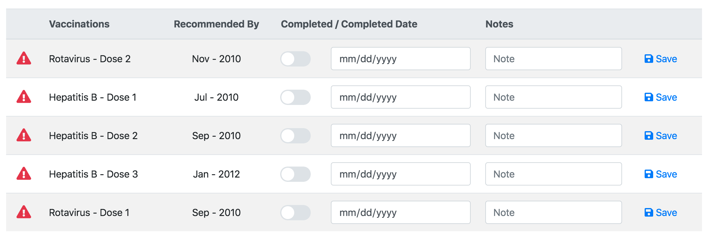

Once the table is available, users can toggle a vaccine to complete status and the current date will populate the date complete field. Users also have the option to enter and save any notes related to a particular vaccination.

When a vaccination has been added to a student's record, a graphic will also update to reflect the percentage of completed and remaining vaccinations.

## Admin User
The Admin User tab allows the currently logged in user to view their profile. The user profile will include the number of registered students and any pending alerts.

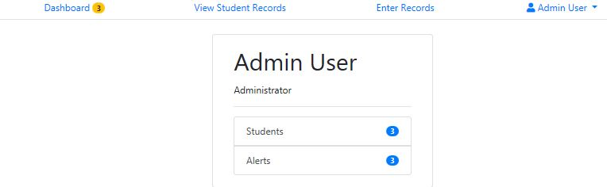 

To access the number of registered students and pending alerts, users will need to select the arrow on the Admin User tab, and then select the *Profile* option from the dropdown menu. Otherwise, the user can opt to log out of the application from the dropdown.

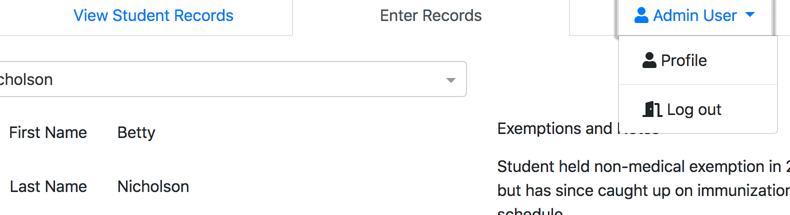

Logging out of the application will remove access to the application and redirect the user to the log in.

# Run

## Running the code/Docker Containers
- `cd code`
- `docker-compose build`
- `docker-compose up` (If you want to start the docker build up without the noise of the sever reqeusts, use `docker-compose up -d`)

## Shutting down the Docker containers
- `docker-compose down`

## Testing if your code is working
- To test if the api project (Java Spring) is running, go to `http://localhost:8888/api` - You should see "Hello World" as an API repsonse from the server
- To test if the webapp project (Angular) is running, go to `http://localhost:4200/ui` - You should see the application login screen

## Resetting your database
- There is an API method that will let you wipe the database and populate it with stubbed data.  Open your browser and go to ``http://localhost:8888/api/reset`` and if you see "Success!" your data has been reset 

## Recalculate notifications
- There is an API method that will let you recalculate your notifications that appear on the dashboard.  Open your browser and go to ``http://localhost:8888/api/notifications/calculate`` and if you see "Notifications Processed!" your notifications will reflect the current state of immunization records.
